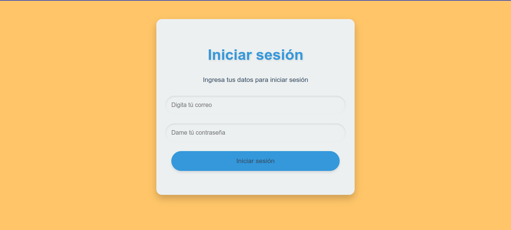

# ForoHub - AluraLatam



## Descripción

Este proyecto es una version de un foro de conversacion sobre cursos o tecnología.


## Tecnologías Utilizadas

- Java
- Spring Boot
- RestAPI
- Angular
- TypeScript

## Instalación

1. Clona este repositorio en tu máquina local:
    ```bash
    git clone https://github.com/Juan-Garavito/Foro-Hub---Alura-Latam.git
    ```
2. Navega hasta el directorio del proyecto:
    ```bash
    cd Foro-Hub---Alura-Latam
    ``` 
3. Para Frontend en Angular
    ```bash
    cd forohub-frontend
    ```
4. Instalar y correr frontend
   ```bash
    npm install
    npm install -g @angular/cli@17
    ng serve
    ```
## Uso

1. Abre con Intellij o IDE de confianza.
2. Ejecutar proyecto desde el IDE.
3. Ejecutar proyecto frontend.

## Desarrollado por

- **Nombre:** Juan Camilo Lozada Garavito
- **LinkedIn:** https://www.linkedin.com/in/juancamilogaravito/
- **GitHub:** https://github.com/Juan-Garavito
